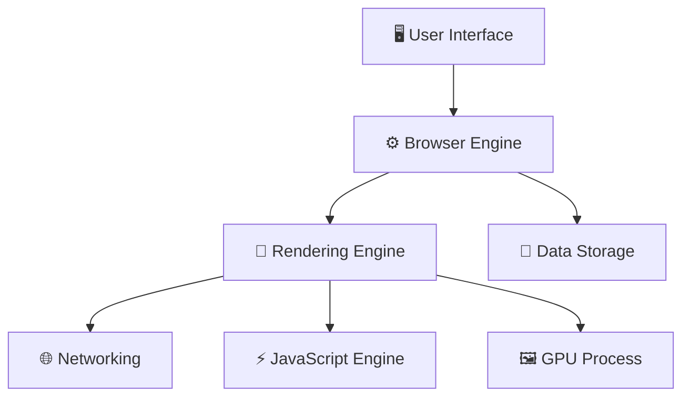

---
tags:
  - browser
  - web-fundamentals
  - moc
aliases:
  - Browser Internals
  - Cách Browser Hoạt Động
date: 2026-03-06
---

# 🌐 How Browsers Work — MOC

> Bản đồ nội dung (Map of Content) về cơ chế hoạt động bên trong của trình duyệt web hiện đại — dành cho Software Engineer muốn hiểu sâu.

---

## Kiến trúc tổng quan



---

## 📚 Danh sách chủ đề

### Core Architecture
- [[Kiến trúc Browser]] — Các thành phần chính, Multi-Process Architecture, Site Isolation

### Từ URL đến Pixels
- [[Navigation Flow]] — Chuyện gì xảy ra khi nhập URL? (DNS → TCP → TLS → HTTP → Commit)
- [[Rendering Pipeline]] — Trái tim của browser (DOM → CSSOM → Layout → Paint → Composite)

### Engine & Runtime
- [[JavaScript Engine]] — V8, Ignition, TurboFan, Event Loop, Microtask vs Macrotask

### Network & Data
- [[Networking Layer]] — HTTP/1.1 vs 2 vs 3, Resource Priority, Caching, Resource Hints
- [[Browser Storage]] — Cookies, localStorage, sessionStorage, IndexedDB, Cache API

### Bảo mật
- [[Browser Security]] — Same-Origin Policy, CORS, CSP, XSS, CSRF, Clickjacking

### Tối ưu hiệu suất
- [[Web Performance Optimization]] — Critical Rendering Path, async/defer, Core Web Vitals

---

## 🧠 Phương pháp học

- [[Phương Pháp Học Browser Internals]] — Mental Model Maps, Active Recall, Hands-on Labs, Feynman Technique, Lộ trình 4 tuần

---

## 🔗 Flow tổng quát: Hành trình của 1 URL

```
URL → DNS → TCP → TLS → HTTP → HTML bytes
                                    ↓
                          Rendering Pipeline
                                    ↓
                              Pixels on screen
```

> [!tip] Cách đọc
> Bắt đầu từ [[Navigation Flow]] để theo dõi hành trình từ đầu đến cuối, sau đó đào sâu vào từng chủ đề.

---

*Tham khảo: [web.dev](https://web.dev), [chromium.org](https://www.chromium.org), [MDN Web Docs](https://developer.mozilla.org)*
