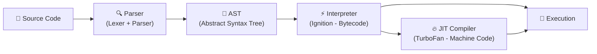
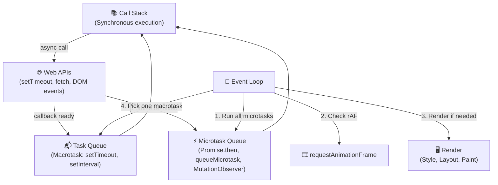

---
tags:
  - browser
  - javascript
  - v8
  - event-loop
date: 2026-03-06
aliases:
  - V8 Engine
  - Event Loop
  - JS Runtime
---

# ⚡ JavaScript Engine

> *Cách browser biên dịch và thực thi JavaScript — từ source code đến machine code.*

Quay lại: [[How Browsers Work MOC]] | Liên quan: [[Rendering Pipeline]]

---

## Quá trình thực thi JavaScript



---

## V8 Engine (Chrome/Node.js) — Các bước chi tiết

1. **Parsing**: Source code → AST (Abstract Syntax Tree)
2. **Ignition** (Interpreter): AST → Bytecode → thực thi ngay lập tức
3. **Profiling**: V8 theo dõi code nào chạy nhiều lần ("hot code")
4. **TurboFan** (Optimizing Compiler): Hot code → Machine Code tối ưu
5. **Deoptimization**: Nếu assumptions sai, quay lại bytecode

```
                      ┌─────────────┐
Source  →  AST  →  Bytecode (Ignition)  →  Execute
                      │
                      ▼ (hot code detected)
                Machine Code (TurboFan)  →  Execute (faster!)
                      │
                      ▼ (deopt: assumption broken)
                   Bytecode (fallback)
```

---

## Event Loop — Single Thread, Non-Blocking

JavaScript chạy trên **một thread duy nhất** nhưng vẫn xử lý async nhờ Event Loop:



---

## Thứ tự ưu tiên trong Event Loop

```javascript
console.log('1: Synchronous');      // 1️⃣ Call Stack

setTimeout(() => {
  console.log('5: Macrotask');      // 5️⃣ Task Queue
}, 0);

Promise.resolve().then(() => {
  console.log('3: Microtask 1');    // 3️⃣ Microtask Queue
}).then(() => {
  console.log('4: Microtask 2');    // 4️⃣ Microtask Queue
});

console.log('2: Synchronous');      // 2️⃣ Call Stack

// Output: 1, 2, 3, 4, 5
```

> [!important] Microtask ưu tiên hơn Macrotask
> Toàn bộ microtask queue được drain hết trước khi Event Loop chuyển sang macrotask tiếp theo. Nếu microtasks liên tục tạo microtasks mới, rendering sẽ bị **block**.

---

## Liên kết

- Rendering: [[Rendering Pipeline]] — JS ảnh hưởng rendering thế nào (parser-blocking)
- Tối ưu: [[Web Performance Optimization]] — `async` vs `defer`, Core Web Vitals
- Kiến trúc: [[Kiến trúc Browser]] — Renderer Process chạy V8
