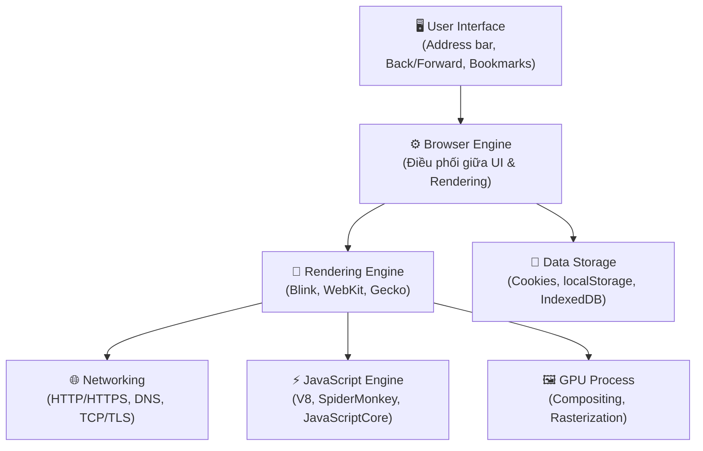

---
tags:
  - browser
  - architecture
  - chrome
date: 2026-03-06
aliases:
  - Browser Architecture
  - Kiến trúc trình duyệt
---

# 🏗️ Kiến trúc Browser

> *Một trình duyệt hiện đại bao gồm nhiều thành phần hoạt động phối hợp với nhau.*

Quay lại: [[How Browsers Work MOC]]

---

## Các thành phần chính

| Thành phần | Vai trò | Ví dụ |
|---|---|---|
| **User Interface** | Mọi thứ người dùng nhìn thấy ngoại trừ nội dung trang | Address bar, tabs, nút back/forward |
| **Browser Engine** | Điều phối giữa UI và Rendering Engine | — |
| **Rendering Engine** | Parse HTML/CSS, xây dựng layout, vẽ pixel | Blink (Chrome), WebKit (Safari), Gecko (Firefox) |
| **JavaScript Engine** | Biên dịch và thực thi JavaScript | V8 (Chrome), SpiderMonkey (Firefox), JSC (Safari) |
| **Networking** | Xử lý các request HTTP/HTTPS | DNS lookup, TCP handshake, TLS |
| **Data Storage** | Lưu trữ dữ liệu phía client | Cookies, localStorage, IndexedDB, Cache API |
| **GPU Process** | Tăng tốc đồ họa, compositing layers | Rasterization, layer compositing |

---

## Multi-Process Architecture (Chrome)

Chrome sử dụng kiến trúc **multi-process** để tăng tính ổn định và bảo mật:

| Process | Vai trò |
|---|---|
| **Browser Process** | Điều khiển UI, tabs, navigation, network. Là "brain" chính |
| **Renderer Process** | Mỗi tab (hoặc mỗi site) có một process riêng. Chạy Blink + V8 |
| **GPU Process** | Xử lý tất cả GPU tasks, compositing, rasterization |
| **Plugin/Utility Process** | Extensions, plugin, utility tasks (audio, video decode) |

> [!important] Site Isolation
> Từ Chrome 67+, mỗi cross-site iframe chạy trong renderer process riêng biệt. Điều này ngăn chặn các cuộc tấn công kiểu Spectre, nhưng cũng tăng RAM usage.

---

## Liên kết

- Tiếp theo: [[Navigation Flow]] — Xem chuyện gì xảy ra khi nhập URL
- Rendering: [[Rendering Pipeline]] — Render Engine hoạt động thế nào
- JS: [[JavaScript Engine]] — V8 engine chi tiết
- Security: [[Browser Security]] — Tại sao cần multi-process cho bảo mật
