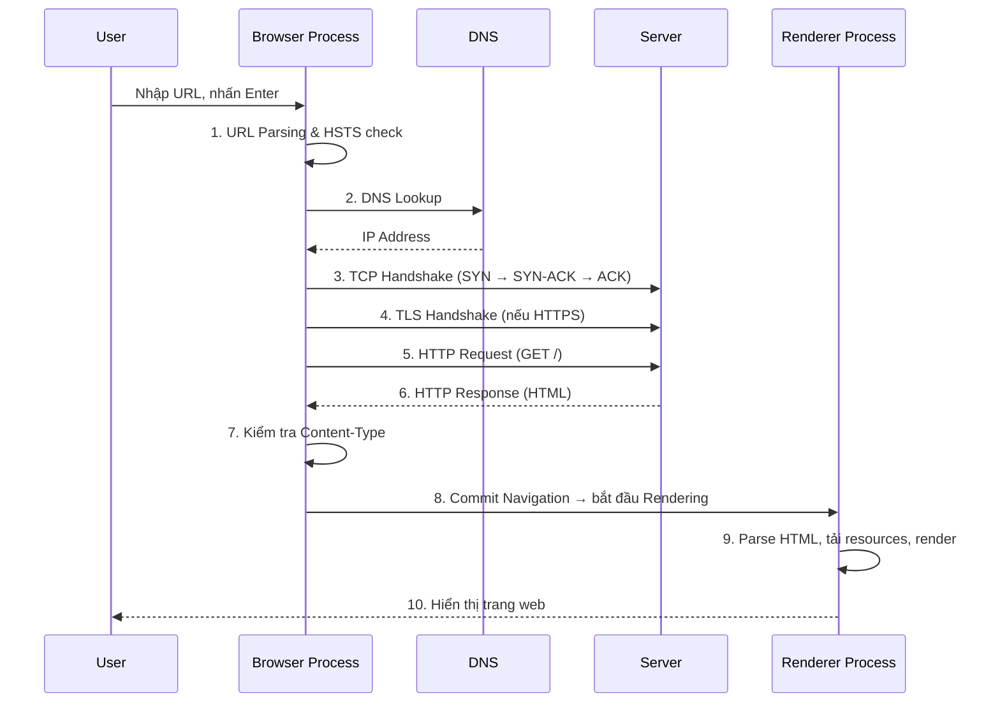

---
tags:
  - browser
  - networking
  - dns
  - tls
date: 2026-03-06
aliases:
  - URL to Page
  - Browser Navigation
---

# 🧭 Navigation Flow — Từ URL đến trang web

> *Toàn bộ chuỗi sự kiện xảy ra khi bạn nhập `https://example.com` và nhấn Enter.*

Quay lại: [[How Browsers Work MOC]] | Trước đó: [[Kiến trúc Browser]]

---

## Tổng quan flow



---

## Chi tiết từng bước

### Bước 1: URL Parsing

- Browser kiểm tra input: đây là **URL** hay **search query**?
- Nếu là URL, browser thêm scheme (`https://`) nếu thiếu
- Kiểm tra **HSTS list** (HTTP Strict Transport Security) — nếu domain nằm trong list, tự động chuyển HTTP → HTTPS

### Bước 2: DNS Resolution

```
example.com → ?

1. Browser DNS Cache (trong memory)
2. OS DNS Cache (/etc/hosts, systemd-resolved)
3. Router Cache
4. ISP DNS Resolver (Recursive)
5. Root DNS Server → .com TLD → Authoritative DNS

Kết quả: 93.184.216.34
```

> [!tip] DNS Prefetching
> Sử dụng `<link rel="dns-prefetch" href="//cdn.example.com">` để resolve DNS sớm cho domain bên thứ 3, giảm latency khi cần tải resource từ domain đó.
> Xem thêm: [[Networking Layer#Resource Hints — Kiểm soát tải trước]]

### Bước 3–4: TCP + TLS Handshake

- **TCP 3-way handshake**: `SYN → SYN-ACK → ACK` (~1 RTT)
- **TLS 1.3 handshake**: Chỉ cần 1 RTT (TLS 1.2 cần 2 RTT)
- Tổng thời gian kết nối: **~2 RTT** trước khi gửi được byte dữ liệu đầu tiên

### Bước 5–6: HTTP Request/Response

- Browser gửi HTTP request với headers (User-Agent, Accept, Cookie, etc.)
- Server trả về response với status code, headers, và body (HTML)
- Xem thêm so sánh HTTP versions: [[Networking Layer#HTTP/1.1 vs HTTP/2 vs HTTP/3]]

### Bước 7: Content-Type Sniffing

- Browser kiểm tra `Content-Type` header để quyết định cách xử lý response
- Nếu `text/html` → chuyển sang [[Rendering Pipeline]]
- Nếu `application/pdf` → sử dụng PDF viewer
- Nếu `application/zip` → bắt đầu download

### Bước 8: Commit Navigation

- Browser Process chuyển dữ liệu sang Renderer Process
- Renderer Process bắt đầu nhận data stream và khởi tạo rendering
- Xem chi tiết: [[Rendering Pipeline]]

---

## Liên kết

- Tiếp theo: [[Rendering Pipeline]] — Browser vẽ pixel như thế nào
- Chi tiết network: [[Networking Layer]] — HTTP versions, caching, resource hints
- Kiến trúc: [[Kiến trúc Browser]] — Browser Process vs Renderer Process
