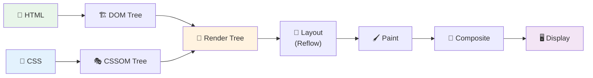

---
tags:
  - browser
  - rendering
  - dom
  - cssom
  - performance
date: 2026-03-06
aliases:
  - Rendering Engine
  - Critical Rendering Path
---

# 🎨 Rendering Pipeline — Trái Tim của Browser

> *Phần quan trọng nhất mà mọi frontend developer cần hiểu sâu.*

Quay lại: [[How Browsers Work MOC]] | Trước đó: [[Navigation Flow]]

---

## Tổng quan Pipeline



---

## 3.1 Parsing HTML → DOM Tree

Browser nhận HTML bytes và chuyển đổi qua các bước:

```
Bytes → Characters → Tokens → Nodes → DOM Tree
```

**Ví dụ:**

```html
<!DOCTYPE html>
<html>
  <head>
    <title>Hello</title>
    <link rel="stylesheet" href="style.css">
  </head>
  <body>
    <h1>Welcome</h1>
    <p>Hello World</p>
    <script src="app.js"></script>
  </body>
</html>
```

**DOM Tree được tạo ra:**

```
Document
├── DOCTYPE: html
└── html
    ├── head
    │   ├── title
    │   │   └── #text: "Hello"
    │   └── link[rel="stylesheet"]
    └── body
        ├── h1
        │   └── #text: "Welcome"
        ├── p
        │   └── #text: "Hello World"
        └── script[src="app.js"]
```

> [!warning] Parser-blocking resources
> Khi HTML parser gặp `<script>` (không có `async`/`defer`), nó **dừng lại hoàn toàn** để tải và thực thi script trước khi tiếp tục parse. Đây là nguyên nhân chính gây chậm trang.
> Xem cách khắc phục: [[Web Performance Optimization#Script Loading: `async` vs `defer`]]

### Preload Scanner

Trong khi main parser bị block bởi script, **Preload Scanner** vẫn quét ahead trong HTML để tìm và bắt đầu tải trước các resource (CSS, JS, images). Đây là optimization cực kỳ quan trọng.

```
Main Parser:    HTML → [BLOCKED by script] → tiếp tục parse
Preload Scanner:           ↓ quét ahead, tìm resources cần tải
                           → tải CSS, images, fonts song song
```

---

## 3.2 Parsing CSS → CSSOM Tree

Tương tự DOM, CSS cũng được parse thành cây:

```
Bytes → Characters → Tokens → Nodes → CSSOM Tree
```

```css
/* style.css */
body { font-size: 16px; }
h1 { color: blue; font-weight: bold; }
p { color: gray; }
```

**CSSOM Tree:**

```
body
├── font-size: 16px
├── h1
│   ├── font-size: 16px (inherited)
│   ├── color: blue
│   └── font-weight: bold
└── p
    ├── font-size: 16px (inherited)
    └── color: gray
```

> [!important] CSS is render-blocking
> Browser **KHÔNG thể** render bất cứ thứ gì cho đến khi CSSOM được xây dựng hoàn chỉnh. Đây là lý do CSS nên được tải càng sớm càng tốt (đặt trong `<head>`).
> Xem thêm: [[Web Performance Optimization#Critical Rendering Path Optimization]]

---

## 3.3 Render Tree

Browser kết hợp DOM + CSSOM để tạo **Render Tree** — chỉ chứa những node **thực sự hiển thị**:

```
DOM Tree + CSSOM Tree → Render Tree

Loại bỏ:
- <head>, <script>, <meta> (không visible)
- Các element có display: none
- Các pseudo-elements ::before, ::after ĐƯỢC thêm vào
```

---

## 3.4 Layout (Reflow)

Browser tính toán **kích thước** và **vị trí chính xác** (pixel) của mỗi element trên viewport:

```
Render Tree → Box Model calculations → Layout Tree

Mỗi element: {
  x, y,        // Vị trí
  width, height // Kích thước
  margin, padding, border
}
```

**Layout là expensive!** Thay đổi kích thước một element cha có thể trigger reflow toàn bộ cây con.

### Các thuộc tính trigger Layout (Reflow)

```
width, height, padding, margin, border
top, left, right, bottom, position
display, float, clear
font-size, font-family, font-weight
text-align, vertical-align, line-height
overflow, white-space
```

---

## 3.5 Paint

Browser vẽ các pixel thực tế. Quá trình này diễn ra qua nhiều **paint layers**:

```
Layout Tree → Paint Records (danh sách lệnh vẽ)

Ví dụ:
1. Vẽ background của <body> (white)
2. Vẽ text "Welcome" (blue, bold, x:50, y:100)
3. Vẽ text "Hello World" (gray, x:50, y:150)
```

### Các thuộc tính chỉ trigger Paint (không reflow)

```
color, background, background-image
border-style, border-radius
box-shadow, outline
visibility
```

---

## 3.6 Compositing

Các layers được gửi lên **GPU** để composite (ghép) lại thành frame cuối cùng:

```
Paint Layers → GPU Rasterization → Composite → Frame → Display
```

**Khi nào element được đưa lên layer riêng?**

- Sử dụng `transform` hoặc `opacity` animation
- Có `will-change: transform`
- `position: fixed` hoặc `position: sticky`
- `<video>`, `<canvas>`, CSS filter, WebGL

> [!tip] Composite-only animations
> `transform` và `opacity` là nhanh nhất vì chúng xảy ra hoàn toàn trên GPU, **bỏ qua Layout và Paint**. Luôn ưu tiên `transform: translateX()` thay vì `left:`, `transform: scale()` thay vì `width:`.
> Xem thêm: [[Web Performance Optimization]]

---

## Tổng kết: Chi phí của mỗi thay đổi CSS

| Thay đổi | Layout | Paint | Composite |
|---|:---:|:---:|:---:|
| `width`, `height`, `margin`, `padding` | ✅ | ✅ | ✅ |
| `color`, `background`, `box-shadow` | ❌ | ✅ | ✅ |
| `transform`, `opacity` | ❌ | ❌ | ✅ |

> Càng ít bước → càng nhanh → UX càng mượt.

---

## Liên kết

- Trước đó: [[Navigation Flow]] — Từ URL đến HTML bytes
- JS tương tác: [[JavaScript Engine]] — Script blocking và Event Loop
- Tối ưu: [[Web Performance Optimization]] — Tối ưu Critical Rendering Path
