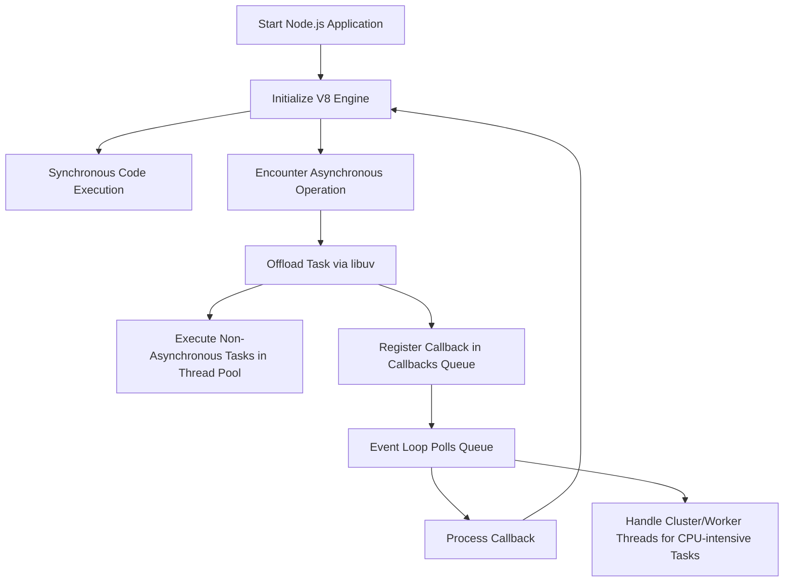

## Overview
Node.js is a runtime environment for executing JavaScript code outside of a browser, primarily designed for building scalable network applications. Its architecture is built around a non-blocking, event-driven model, making it ideal for I/O-bound applications. This documentation details the core components and operational flow of Node.js.

## 1. V8 JavaScript Engine

### Role
- **Execution Engine:** Node.js uses Google's V8 engine to compile and execute JavaScript code.
- **Performance:** V8 compiles JavaScript into native machine code through Just-In-Time (JIT) compilation, enhancing runtime performance.

### Key Points
- **Compilation:** JIT compilation transforms code at runtime, leading to faster execution.
- **Native Execution:** Once compiled, the native code executes quickly, forming a robust foundation for high-performance applications.

## 2. The Event Loop

### Core Concept
- **Single-Threaded Model:** Node.js operates on a single-threaded event loop to manage asynchronous operations efficiently.
- **Concurrency Management:** Although the JavaScript execution is single-threaded, the design allows many operations to be processed concurrently without blocking.

### How It Works
- **Synchronous Execution:** The application initially executes synchronous code.
- **Asynchronous Offloading:** When an asynchronous task (e.g., file I/O or network request) is encountered, it is offloaded.
- **Callback Queue:** Upon completion of an asynchronous operation, its callback is added to a queue for later execution.
- **Event Loop Phases:** The event loop cycles through multiple phases (timers, I/O callbacks, idle/prepare, poll, check, and close callbacks), each handling specific tasks.

## 3. libuv and Non-Blocking I/O

### Overview
- **libuv Library:** A multi-platform C library that provides Node.js with a unified API for asynchronous I/O operations across different operating systems.

### Operation Details
- **Thread Pool:** For operations not natively supported as asynchronous by the OS (such as file system operations), libuv utilizes a thread pool.
- **Event Notification:** Once an operation completes in the background, libuv notifies the event loop so that the associated callback can be executed.

## 4. Asynchronous Programming Patterns

### Methods
- **Callbacks:** 
  - The traditional approach using an error-first pattern (i.e., `function(err, data)`).
- **Promises and Async/Await:** 
  - Modern constructs that simplify asynchronous code management and reduce the complexity of nested callbacks.

### Rationale
- These patterns enable developers to write cleaner and more maintainable asynchronous code, mitigating issues like “callback hell.”

## 5. Module System and Ecosystem

### Module Systems
- **CommonJS Modules:** 
  - Initially, Node.js employed the CommonJS module system using `require()` for encapsulating and reusing code.
- **ECMAScript Modules (ESM):** 
  - Modern versions support ES Modules using `import`/`export` syntax, aligning with current JavaScript standards.

### Ecosystem
- **npm:** 
  - Node.js’s package manager that provides access to a vast ecosystem of libraries and tools, fostering rapid development and code reuse.

## 6. Handling Concurrency and Scalability

### Single-Threaded Core
- **Event Loop:** 
  - The primary JavaScript execution remains single-threaded, simplifying concurrency management.

### Multi-Core Utilization
- **Cluster Module:** 
  - Allows the creation of multiple processes to leverage multi-core systems.
- **Worker Threads:** 
  - Enables offloading of CPU-intensive tasks to separate threads without blocking the event loop.

## 7. Execution Flow Overview

### Step-by-Step Process
1. **Startup:**  
   - Node.js initializes the V8 engine and loads the JavaScript application.
2. **Synchronous Execution:**  
   - The application executes synchronous code until it reaches asynchronous tasks.
3. **Offloading Work:**  
   - Asynchronous operations are handed off to libuv and, if needed, to a thread pool.
4. **Event Loop Processing:**  
   - The event loop continuously checks for completed asynchronous tasks and processes their callbacks.
5. **Process Completion:**  
   - The cycle continues until there are no remaining callbacks or pending operations, at which point the process exits.

## 8. Evolving Features and Considerations

### Error Handling
- **Error-First Pattern:** 
  - Standard for callbacks; with promises and async/await, try/catch blocks are used for managing errors.

### CPU-bound Tasks
- **Potential Blocking:**  
  - Heavy computations can block the event loop. For such scenarios, offloading work to child processes or worker threads is recommended.

### Continuous Development
- **Ongoing Enhancements:**  
  - Node.js is continuously evolving. New features such as improved diagnostics and enhanced worker thread support may further optimize its operation.

## Mindmap




```mermaid
mindmap
  root((Node.js Operation))
    V8((V8 JavaScript Engine))
      JIT("Just-In-Time Compilation")
      Native("Native Code Execution")
    EventLoop((Event Loop))
      Sync("Synchronous Execution")
      Async("Asynchronous Operations")
        Offload("Task Offloading")
        Queue("Callback Queue")
        Phases("Event Loop Phases")
    libuv((libuv & Non-Blocking I/O))
      ThreadPool("Thread Pool for Offloading")
      Notify("Event Notification")
    AsyncPatterns((Asynchronous Programming Patterns))
      Callbacks("Error-first Callbacks")
      Promises("Promises & Async/Await")
    ModuleSystem((Module System & Ecosystem))
      CommonJS("CommonJS Modules (require)")
      ESM("ECMAScript Modules (import/export)")
      npm("npm Package Manager")
    Concurrency((Concurrency & Scalability))
      Single("Single-Threaded Core")
      Multi("Cluster & Worker Threads")
    ExecutionFlow((Execution Flow))
      Startup("Initialize V8 & Load App")
      SyncExec("Synchronous Execution")
      AsyncOffload("Offload Async Tasks")
      Process("Event Loop Processes Callbacks")
      Complete("Process Completion")
    Considerations((Evolving Features & Considerations))
      ErrorHandling("Error Handling (try/catch, error-first)")
      CPUbound("Managing CPU-bound Tasks")
      Updates("Continuous Development")
````

## Conclusion
Node.js integrates the high-performance V8 engine with a non-blocking event loop, supported by libuv, and a robust module system to build scalable network applications. Its architecture efficiently handles numerous simultaneous connections while maintaining simplicity in development.

*Note:* This documentation is based on established design principles and current practices in Node.js. For the most up-to-date information and recent enhancements, refer to the official [Node.js documentation](https://nodejs.org/en/docs/).